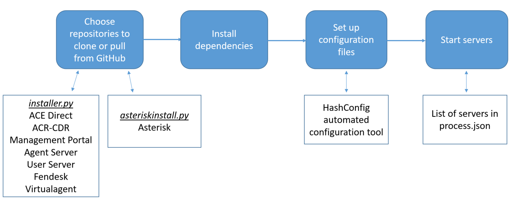

# Automated Installation Scripts
This is the README.md file for the automated installation scripts for ACE Direct. The installation scripts 
clone or pull the necessary repositories from GitHub. Then for each repository the scripts install packages 
and their dependencies, set up the configuration files, and finally start their associated servers. The scripts 
include an option to use HashConfig, an automated configuration and encoding tool, during the configuration 
process. The following diagram visually describes the installation script.
<p align="left">
	
</p>

## Code Structure
The script installer.py allows the user to install any of the following repositories in any order:
ACE Direct, ACR-CDR, Management Portal, Aserver, Userver, and Fendesk.

The script asteriskinstall.py installs Asterisk.

## Prerequisites
The installation scripts require the following:

* The machine operating system must be CentOS (version 7 or newer) or RedHat Linux.

* Node.js is installed on the user machine.

* Python 2.7 is installed on the user machine.

* MySQL is installed on the user machine, and the user has access to the username and password.

* The Asterisk installation script also requires that the public/private key pair 
for Git must be added to /root/.ssh and their permissions must be 600. For more 
information on generating and adding the keys, refer to [this link]
(https://help.github.com/articles/connecting-to-github-with-ssh/)


## Instructions for Use: installer.py
1. Open the parent directory where the autoinstall repository will be placed; the home directory is suggested.

2. Clone this repository. 
 
3. Copy installer.py from the autoinstall directory to the home directory, and enter the home directory.

4. Run 
```sh
python ./installer.py
```
Follow the instructions; select any subset of the repositories to install. To install all repositories,
select the quick install option.

5. For a one-click install, save the properly-configured, decoded configuration files in the /home/centos directory with the
naming convention "config_<i>repository name</i>.json_TEMPLATE". Then choose the quick install option.


## Instructions for Use: asteriskinstall.py
1. To run the asteriskinstall.py script, open the shell as sudo with the command
```sh
sudo -i
```

2. After configuring the proxy, run the script using the command

```sh
python ./asteriskinstall.py
```

When prompted, enter values for the following options:

* \<public_ip>: The external/public IP address of the Asterisk server

* \<local_ip>: The private/local IP address of the Asterisk server

* \<dial_in>: Dial-in number

* \<stun_server>: STUN/TURN server address:port (we recommend building a dedicated STUN server, but a public STUN server can be used if desired)

* \<public_key>: Public key for Asterisk server

* \<crt_key>: Private key for Asterisk server 
